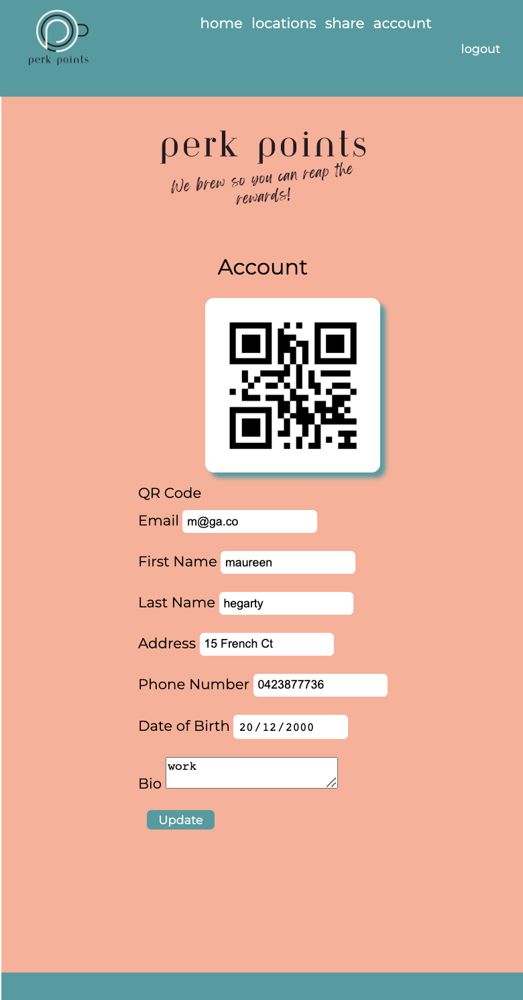
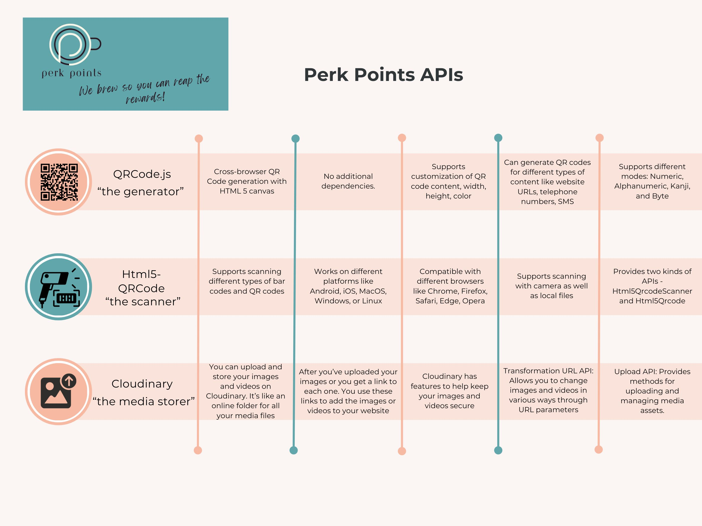

# Perk Points - We brew so you can reap the Rewards!

Perk Points is a Coffee Card Loyalty Program which rewards members with points from purchasing coffees, posting coffee pics on the app.

## to see my live project [here](https://perk-points-yr5i.onrender.com)

## About

- best used on mobile device
- requires account creation to become a member
- Members would include "users" and "venue owners"
- list of partner locations

## Planning & Problem Solving

- Talk about approach to the problem.
- Screenshots/drawings of doodles/plans during the planning phase.

- ERD draft notes
  

- SQL tables (more could be created including locations, prices, coffee shops)
  
  

- Perk Points Logo & Wordmark "We brew so you can reap the rewards!"
  .png>)
- Flow charts of app logic.
  [Wireframing](https://trello.com/b/E3kJ2mCb/perk-points-coffee-card)

## Cool things

- @media (max-width: 600px) media query to make a condition to change the viewport and nav menu appears at the bottom of page
- Programming languages: JavaScript Programming, SQL Databases

## Bugs to fix

- Image upload not uploading url to database - just to Cloudinary account

## Lessons learnt

- More planning to define tables eg a locations table to mirror upload of pic of favourite cafe
- More debugging
- More testing

## Future features

- Add coffee shop owners data
- Add testimonials to home page
- Add share button to users social media account
- Add FAQ & support page
- Add paid advertising of affiliate coffee suppliers
- Please refer to [Trello Board](https://trello.com/b/E3kJ2mCb/perk-points-coffee-card)  

============================================================

# Further features - Part 2

## About

Users can keep track of the points they earn on their Perks Point account.
When a user creates an account they receive a unique QR Code. Café owner scans this QR code after a coffee purchase, and the unique ID encoded in the QR code can be used to identify the user in the PostgreSQL database.

## to see my live project [here](https://perk-points-yr5i.onrender.com)

### Planning

QR Code Generation: `Generating a unique QR code` for each user with their unique ID encoded in it. To be done in via an Express.js route. 

 
 &darr;  &darr;  &darr;

Scanning the QR Code: ` Café owner scans the QR code` using a scanner. This scanner can be a standalone device or a smartphone app. The scanner should be able to interpret the QR code and extract the user’s unique ID. 

 
 &darr;  &darr;  &darr;

Updating the Database: Once the café owner’s system has the user’s unique ID from the QR code, it can `send a request to the server to update the user’s points.` This could be done through an API endpoint on the server that accepts the user’s ID and the number of points to add. This endpoint would then update the user’s points in the PostgreSQL database. 

 
 &darr;  &darr;  &darr;

Displaying Points to the User: After the points have been updated, the `new total can be displayed to the user on their account page.` This could be done through another API endpoint that retrieves the user’s current points from the database using their unique ID. 
 

### User - Unique User QR Code to log points

### JavaScript QRCode Library

The JavaScript QRCode library is a tool that allows you to generate QR codes within your JavaScript application

- in Node.js you install and require the QRCode module
- QRCode.toFileStream allows generating a QR Code on the server side which is then sent directly to the client
   

 
 &darr;  &darr;  &darr;

- alter table to include "points" field
- include points field on account page

### Html5-qrcode

The html5-qrcode library for QR code scanning is for web applications and is an open-source library built by mebjas. It provides two kinds of APIs: Html5QrcodeScanner and Html5Qrcode

### Owner's Page

- user_routes.js or separate owners_routes.js file?
- owner verification more difficult on client side because can be easily manipulated by user

#### Owner verification

In existing signup, owner checks a box when signing up

<u>Verification Email</u>: When a user signs up as an owner, you could require them to verify their status. This could be done through a verification email sent to an official email address, or by asking them to upload a document that proves their status.

<u>Admin Approval</u>: You could add an approval process where an admin has to manually confirm that the user is an owner before their account is activated.

<u>Database Check</u>: If you have a separate database of owners, you could check the submitted email address against that database to confirm the user is an owner.

These checks are done on the server-side after the form is submitted.

### Perk Points APIs - and some of their features

### Bugs

- multiple scans when single wanted
- Single scan when multiple wanted
- currently hard-coded to one cafe owner
